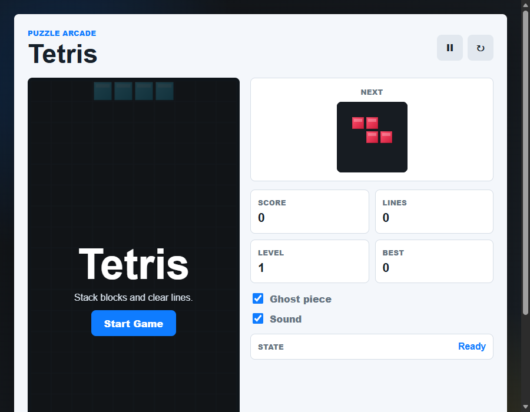

# Tetris Game

A responsive browser-based Tetris game built with HTML, CSS, and JavaScript.

## Live Demo

**[Play Now on GitHub Pages](https://sriram127.github.io/Tetris_Game/)**

[](https://sriram127.github.io/Tetris_Game/)

## Screenshot



## Features

- Classic seven tetromino pieces
- Canvas-based 10×20 game board
- Next-piece preview
- Score, lines, level, and best-score panels
- Best score saved with `localStorage`
- Increasing speed as levels rise
- Animated line clears with particles
- Collision shake feedback
- Ghost piece toggle
- Sound toggle
- Pause and restart controls
- Keyboard controls for desktop
- Touch swipe controls for mobile

## Tech Stack

- HTML5 Canvas
- CSS3
- Vanilla JavaScript

## Run Locally

Open `index.html` directly in any browser, or start a local server:

```bash
python -m http.server 8020
```

Then open `http://127.0.0.1:8020/` in your browser.

## Controls

| Action | Keyboard |
|---|---|
| Move left | `ArrowLeft` / `A` |
| Move right | `ArrowRight` / `D` |
| Soft drop | `ArrowDown` / `S` |
| Rotate | `ArrowUp` / `W` |
| Hard drop | `Space` |
| Pause | `P` |

Mobile: swipe left/right/down to move, swipe up to rotate, tap to hard drop.

## Project Structure

```text
Tetris_Game/
├── index.html
├── style.css
├── app.js
├── screenshot.png
├── README.md
└── .gitignore
```

## Deployment

This repository is automatically deployed to **GitHub Pages** via GitHub Actions on every push to `main`/`master`. The workflow file is at `.github/workflows/deploy.yml`.
